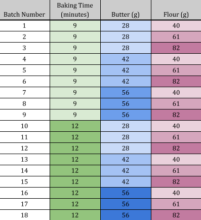

```{r setup, include=FALSE}
knitr::opts_chunk$set(echo = FALSE)
library(tidyverse)
library(gglm)
library(patchwork)
ggplot2::theme_set(theme_bw())

cookies <- readRDS("data/cookies.rds")
```

## Introduction

Baking is one of the oldest known forms of preparing foods. As techniques and recipes evolved over the years, making baked goods has become as much of a science as it is an art.  The correct measurements of each ingredient that goes into a treat is very precise, and differing from the given instructions from a recipe can lead to drastic changes in the outcome of whatever is being prepared. This project aims to examine the effects that changing several parameters of a chocolate chip cookie recipe has on the diameter of the cookie using a linear regression model.

Most cookies have similar basic ingredients including flour, butter, brown or white sugar, among other ingredients that add flavor such as salt or extracts. The main objective of this project was to examine the impact that changing a recipe has on the diameter of the cookie. We hypothesize that the diameter of the cookie is mostly controlled by the amount of flour and butter, but they are also modified by other variables including baking time. To investigate the relationship between cookie diameter and varying a recipe, a linear regression model for the diameter of a finished cookie in terms of the amount of butter used, the amount of flour used, and the time spent in the oven was developed. The proposed model is:

\begin{equation}
\tag{Model 1}
y_i = \beta_0 + \beta_1x_{1i} + \beta_2x_{2i} + \beta_3x_{3i} + \epsilon_i
\end{equation}

Where $\epsilon$ is assumed to follow a normal distribution $N(0, \sigma^2)$, and the other variables are as follows:

\begin{itemize}
	\setlength\itemsep{-0.1em}
    \item [$y$]:           Cookie diameter (inches)
    \item [$x_1$]:         Flour (grams)
	\item [$x_2$]:         Butter (grams)
	\item [$x_3$]:         Baking Time (minutes)
\end{itemize}

These ingredients were chosen as they were both essential ingredients for cookies that could influence cookie size. Baking time was also chosen to be investigated since cookies tend to get flatter as they cook. 


## Methods

In total, 18 batches of 3 cookies each were baked for this experiment; yielding a total of 54 cookies overall. For each batch, the baking time, along with the amounts of flour and butter used, were varied according to an experimental design outlined in Table 1. Other ingredients, including eggs, sugar, baking soda, etc., were held constant across batches. Additionally, variables such as oven temperature and oven placement were controlled across batches.  A digital scale was used to precisely measure the quantity of each ingredient (0.1 grams precision). The following recipe was used for this experiment:

\begin{itemize}
	\setlength\itemsep{-0.1em}
    \item 1 egg yolk
	\item 25 grams sugar
	\item 50 grams brown sugar
	\item 60 grams chocolate chips
	\item 0.5 grams salt
	\item 1.3 grams baking soda
	\item 2 grams vanilla extract
	\item 40, 61, or 82 grams flour
	\item 28, 42, or 56 grams butter
\end{itemize}

Cookies were baked at 350° F for 9 or 12 minutes on a nonstick cookie sheet. A digital timer was used to ensure that each batch of cookies was baked for the appropriate number of minutes.
\newline

**Table 1.** Experimental design.
```{r pressure, echo=FALSE, out.width = '50%', fig.align = "center"}

```

\newpage

## Results

Once we had baked and measured all of our cookies, it was time to begin modeling with our data. Before diving deep into modeling, we first took the important step of exploratory data analysis. To get a good sense of our data, we plotted each explanatory variable with the response variable. Figure 1 shows these relationships.
\newline

```{r eda_plots, fig.height=2.5}
p1 <- ggplot(cookies) + 
  geom_point(aes(x = flour_g, y = diameter_in)) +
  theme_bw() +
  labs(x = "Flour (grams)",
       y = "Cookie Diameter (inches)")

p2 <- ggplot(cookies) + 
  geom_point(aes(x = butter_g, y = diameter_in)) +
  theme_bw() +
  labs(x = "Butter (grams)") +
  theme(axis.text.y = element_blank(),
        axis.title.y = element_blank(),
        axis.ticks.y = element_blank())

p3 <- ggplot(cookies) + 
  geom_point(aes(x = time_in_oven_min, y = diameter_in)) +
  theme_bw() +
  labs(x = "Baking Time (minutes)") +
  theme(axis.text.y = element_blank(),
        axis.title.y = element_blank(),
        axis.ticks.y = element_blank())

p1 + p2 + p3
```
**Figure 1.** Exploratory data analysis. These three plots show the general tendencies of each of the predictor variables on the response variable (cookie diameter).
\newline

Initially, we see that the relationship between cookie diameter and butter is moderate in strength and positive. The linearity of this relationship needs to be examined further, but generally the trend is somewhat linear. Further, the relationship between cookie diameter and flour seems to be even stronger, but now a negative relationship. This tells us that as we increase the flour in a cookie, we would expect the cookie diameter to decrease (and of course, the converse for butter). The relationship between cookie diameter and time in oven is extremely hard to discern, and from Figure X we expect time in oven to have a very minimal effect on cookie diameter, if any. 

Now, we move to modeling. We first fit the candidate model described in the Introduction, Model 1,
\begin{equation}
\tag{Model 1}
y_i = \beta_0 + \beta_1x_{1i} + \beta_2x_{2i} + \beta_3x_{3i} + \epsilon_i
\end{equation}
We fit the model in R and assess Model 1 via the quartet of diagnostic plots provided by the `gglm` R package, and by metrics from the model summary. Figure 2 displays Model 1's diagnostic plot quartet.
\newline

```{r}
m1 <- lm(diameter_in ~ butter_g + flour_g + time_in_oven_min, cookies)
gglm(m1, theme = theme_bw()) +
    plot_annotation(title = "Model 1 Diagnostics",
                    theme = theme(plot.title = element_text(hjust = 0.5)))
```
**Figure 2** Model diagnostics for Model 1, highlighting a violation of the independent error term assumption. 
\newline

Figure 2 shows some departures from essential modeling conditions. Most notably, we see a U-shaped pattern in the residuals vs fitted plot. This violates the assumption that the error terms are independent of each other, and tells us that there is some curvature in some relationship between the response and an auxiliary variable that we are not accounting for in Model 1. Further, we see some higher leverage points with large residuals. These points could be highly influential in determining the model parameter estimates, and may be causing some bias in our model parameter estimates. Outside of these issues, the other model diagnostics look good for the initial candidate model. We also find that Model 1's model fit is quite good to begin with, with an $R^2$ value of `r round(summary(m1)$r.squared, 3)`. We find that for Model 1, all variables expect time in oven are significant at the 0.001 level, and time in oven is not significant at all. 

We now move to attempting to fix the issues made apparent by the diagnostic plots, while maintaining good model fit. Largely, we had two approaches to addressing the diagnostic issues. Both approaches remove the time in oven variable as it was seen to not benefit the model, while adding the complexity of another variable. The first approach considers adding both a multiplicative interaction term between butter and flour, and a squared term for butter. We fit Model 2 as follows:

\newpage

\begin{equation}
\tag{Model 2}
y_i = \beta_0 + \beta_1 x_{1i} + \beta_2 x_{2i} + \beta_4 x_{4i} + \beta_5 x_{5i} + \epsilon_i
\end{equation}

\begin{itemize}
	\setlength\itemsep{-0.1em}
	\item [$y$]:           Cookie diameter (inches)
    \item [$x_1$]:         Flour (grams)
	\item [$x_2$]:         Butter (grams)
	\item [$x_4$]:         Butter $\times$ Flour ($\text{grams}^2$)
	\item [$x_5$]:         $\text{Butter}^2$ ($\text{grams}^2$)
\end{itemize}

Again, we fit Model 2 in R and initially look at the diagnostic plots shown in Figure 3.
\newline

```{r}
cookies <- cookies %>%
  mutate(f_times_b = flour_g * butter_g,
         butter_sq = butter_g^2)
m2 <- lm(diameter_in ~ butter_g + flour_g + f_times_b + butter_sq, cookies)
gglm(m2, theme = theme_bw()) +
    plot_annotation(title = "Model 2 Diagnostics",
                    theme = theme(plot.title = element_text(hjust = 0.5)))
```
**Figure 3.** Model diagnostics for Model 2, highlighting improved model fit compared to Model 1, but with a persistent U-shaped pattern in the residuals. 
\newline

Figure 3 shows that Model 2 begins to address the issue of the U-shaped residuals and high leverage-high residual points, however the residuals seem to still follow a vaguely U-shaped pattern. With Model 2, we find that the only term significant at the 0.05 level is the flour times butter term as it seems to soak up similar attributes in the model to butter and flour alone, along with the square of butter. This tells us there might be an issue with multicollinearity, which could cause issues with model interpretability and the stability of the estimates for our $\beta$'s. The $R^2$ value for Model 2 was `r round(summary(m2)$r.squared, 3)`, which is an increase in $R^2$ compared to Model 1. We also see an adjusted $R^2$ increase from 0.790 to 0.853 when comparing with Model 1, leading us to believe that adding these terms is still improving model fit. 

Our final model, Model 3, takes a different approach at correcting model diagnostics and improving fit, all while maintaining a high level of interpretability. For Model 3, we first fit the model:

\begin{equation}
\tag{Model 3}
y_i = \beta_0 + \beta_1 x_{1i} + \beta_2 x_{2i} + \beta_6 x_{6i} + \epsilon_i
\end{equation}

\begin{itemize}
	\setlength\itemsep{-0.1em}
	\item [$y$]:           Cookie diameter (inches)
    \item [$x_1$]:         Flour (grams)
	\item [$x_2$]:         Butter (grams)
	\item [$x_6$]:         Butter/Flour 
\end{itemize}

We believe that the ratio of butter to flour explains the change in cookie diameter with high interpretability, as the amount of butter and amount of flour are thought to explain the change in cookie diameter, but how they effect cookie diameter likely changes based on how much of the other is already in the cookie. Plotting the ratio of flour to butter against cookie diameter shows a much stronger relationship than their product, and so we fit Model 3 with this ratio. Figure 4 show the model diagnostics for Model 3.
\newline

```{r}
cookies <- cookies %>%
  mutate(bf_ratio = butter_g/flour_g)

m3 <- lm(diameter_in ~ butter_g + flour_g + bf_ratio, cookies)
gglm(m3, theme = theme_bw()) +
    plot_annotation(title = "Model 3 Diagnostics",
                    theme = theme(plot.title = element_text(hjust = 0.5)))
```
**Figure 4.** Model diagnostics for Model 3, highlighting little to no pattern in the residual vs. fitted plot and improved model fit overall. 
\newline

We see that any discernible pattern in the residual vs fitted plot is gone, and all other diagnostic plots look satisfactory. All variables included in Model 3 were significant at the 0.05 level, and the $R^2$ value for Model 3 is 0.937 with an adjusted $R^2$ of 0.932. These metrics tell us that the model fit is quite good. 


## Discussion

The results of this experiment clearly suggest that variables such as amounts of flour and butter used significantly affect the final diameter of baked cookies, while other factors such as baking time have less significant influence. By comparing all factor level combinations, the controlled experiment conducted here provides opportunities to explore potential interactions between variables that may better explain the observed response in cookie diameter. To this end, the ratio of flour and butter used was considered, and was determined to provide increased explanatory power regarding cookie diameter. This significant interaction likely stems from the unique physical properties of both ingredients, which each have opposing effects on final cookie diameter. Specifically, flour acts as a binding agent in the baking process, which holds the cookie together and reduces spreading, leading to smaller diameter cookies. In contrast, butter serves as a source of fat, which melts at high temperatures and leads to increased spreading of baked cookies. Together, these ingredients have been known to interact during the baking process, where small granules of flour may be coated by the butter, forming heterogeneous pockets of both dry and fat-coated flour. In this way, butter and flour may neutralize each other in some respects. 

While the levels of ingredients such as flour and butter were determined to be significant,  baking time was not found to significantly affect the final diameter of the baked cookies in this experiment. Although this finding is in disagreement with our initial hypotheses, we provide two potential explanations. First, it is  possible that by only considering two baking time levels (9 and 12 minutes), the effect of baking time on final cookie diameter may not have been fully explored. It is possible that baking times of greater and lesser amounts may better capture the influence of baking time on final cookie diameter. Second, it may be the case that baking time simply has less of an effect on cookie diameter, and a greater influence on other response variables such as cookie texture and color. In this case, baking time still may have a significant effect on properties of baked cookies, but in the case of cookie diameter, the relationship is weak at best. 

Although several steps were taken to hold uncontrolled variables constant, some limitations in our experimental design may still persist. These limitations include placement of cookies in the oven, precise monitoring of oven temperature, degree of mixing of ingredients, among others. These factors likely create noise in our observed response function, and in the future, other variables should be considered to fully capture the influencing factors of baking technique on final cookie diameter. Our design was also limited by our capacity to bake many different batches of cookies, which was both cost and time prohibitive. Further studies may increase the sample size and number of factor levels considered for each variable to gain a better understanding of the influence of different baking methods on final cookie diameter. Other factors that may be considered include oven temperature, amount of eggs, baking soda, and sugar, among others. 

## Conclusion

In this study, a controlled experiment was conducted to determine how factors such as amounts of flour and butter used, and baking time, affect the final diameter of baked cookies. We observed significant effects of flour and butter, along with their interaction effect, while baking time remained insignificant overall. Our study may have been limited by uncontrolled factors such as precise oven temperature and consistency in ingredient mixing methods, along with our limited ability to bake many batches of cookies of different factor levels. In the future, studies may emphasize a greater number of factor levels to better capture the relationship between baking methods and cookie diameter, as well as collect a greater number of samples to aid analysis. 

## References
